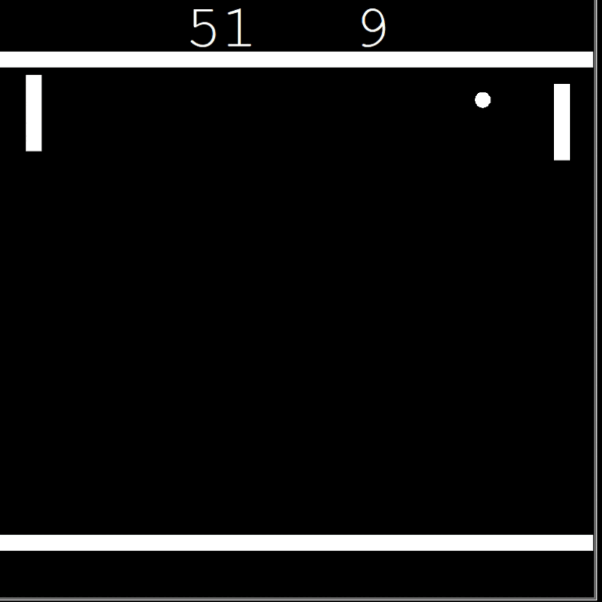
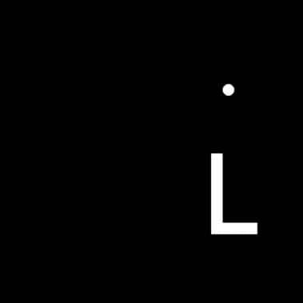
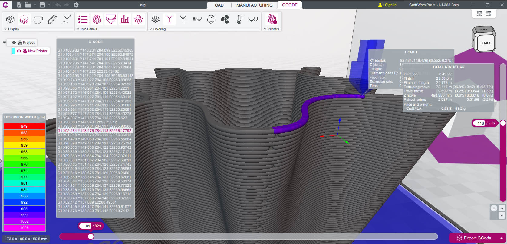

Welcome to my page!   I'm Stan, backend developer from  <b>Poznan, Poland</b>
     
<h3>Things I use</h3> 
  
                

        

  
  
  
  
  
   
    
  
  
    
  
  
  
  
  
  
  

<h3>Contact:</h3>

- 🌱 I’m currently learning Django RestApi, and bulding Django-shop
- ⚡ Fun facts: I love extreme sports like kite-surfing, dancing and i'm healthy food freak
- 🎮 Games which i love- logic games like Baba is you, Braid and ... Resident Evil 7 :D

<h3>PROJECTS</h3>
<table>
 <tr>
    <th>Django Blog</th>
    <th>Pong Multiplayer Online Game</th>
 </tr>
 <tr>
  <td width="50%">
   <a href="https://github.com/Stanotech/Django_blog"> </img></a>   
  </td>
  <td width="50%">
  <a href="https://github.com/Stanotech/Pong-multiplayer-online"> </img></a>   
  </td>
 </tr>
</table>

 
  
<table style="margin:0 auto;">
 <tr>
    <th>Snake game</th>
    <th>Vending machine for courts lights</th>
 </tr>
 <tr style: width="100%">
  <td width="50%">
   <a href="https://github.com/Stanotech/Snake"> </img></a>   
  </td>
  <td width="50%">     
   <a href=https://github.com/Stanotech/VENDING-MACHINE-from-scratch> </img></a>
  </td>
 </tr>
</table>

<table>
 <tr>
    <th>Checkio</th>
    <th>G-code modifier</th>
 </tr>
 <tr>
  <td width="50%">
   <a href="https://github.com/Stanotech/perfection_training_checkio"> </img></a> 
  </td>
  <td width="50%">
   <a href="https://github.com/Stanotech/seam_eraser_gcode"> </img></a> 
  </td>
 </tr>
</table>

